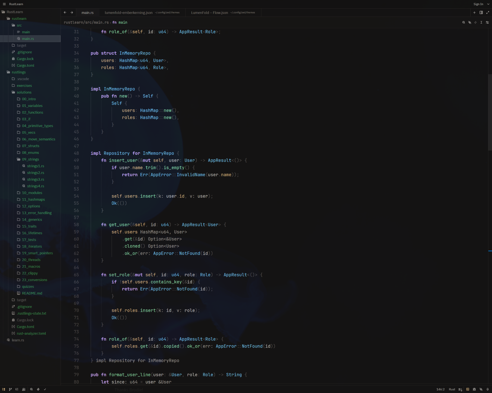
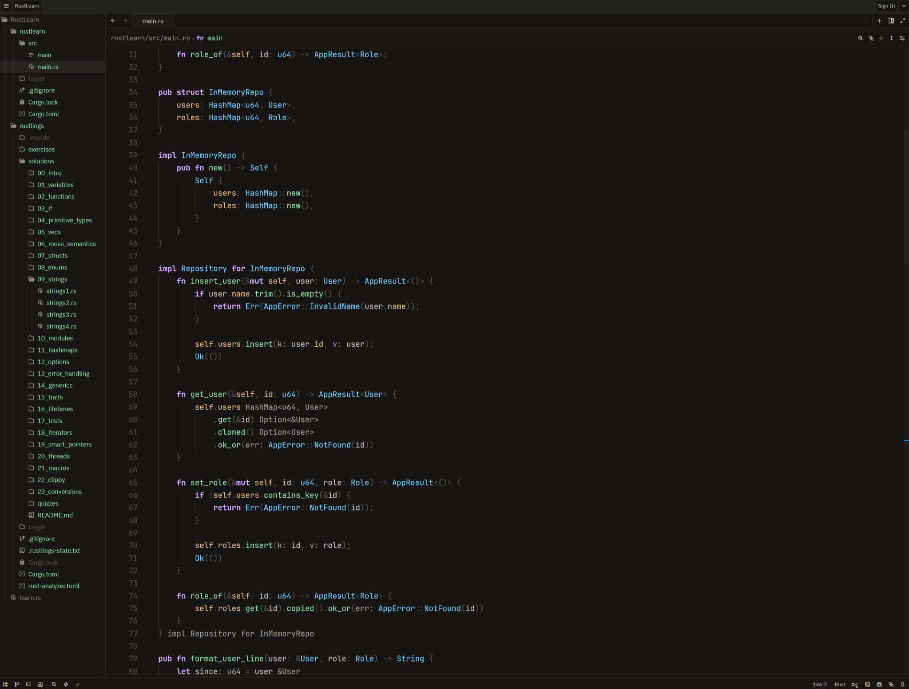
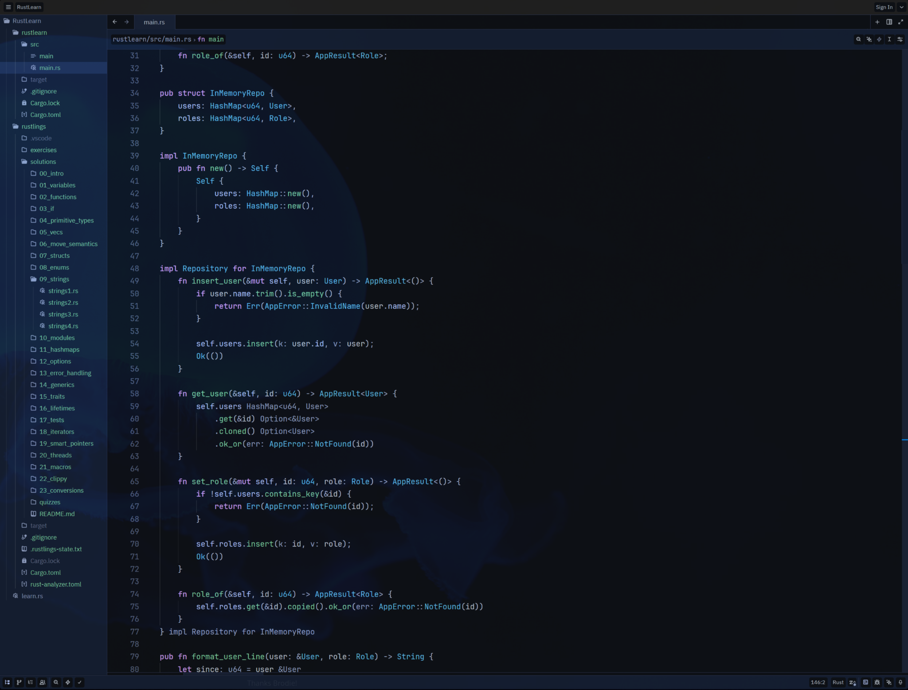
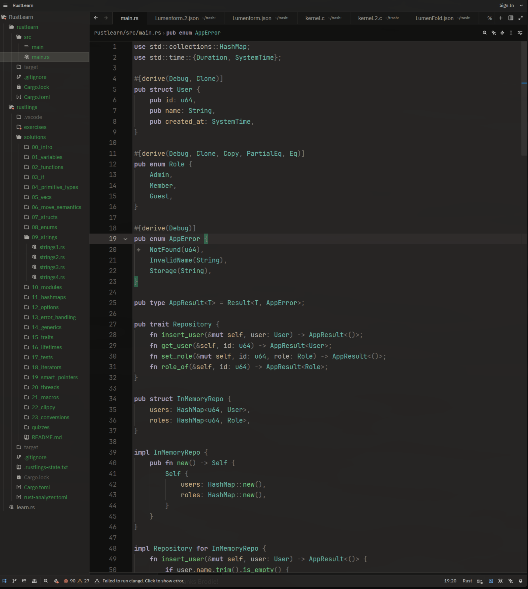
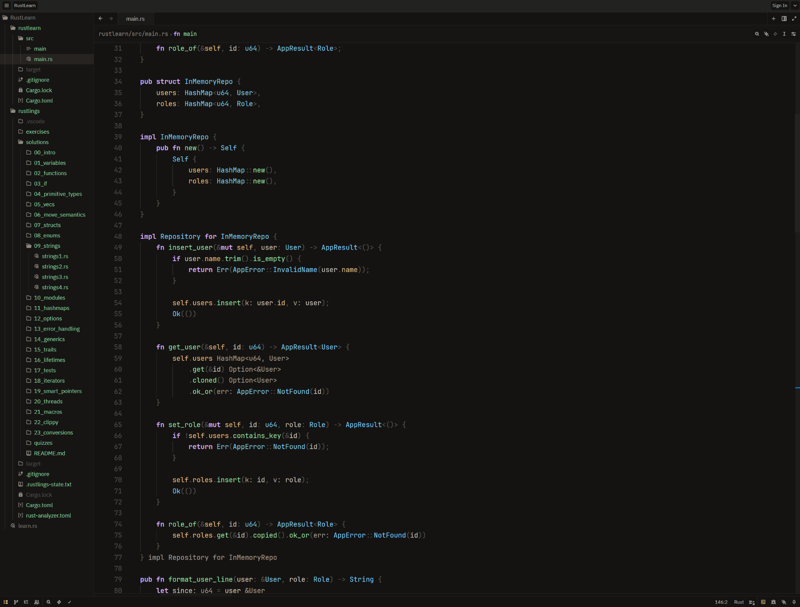
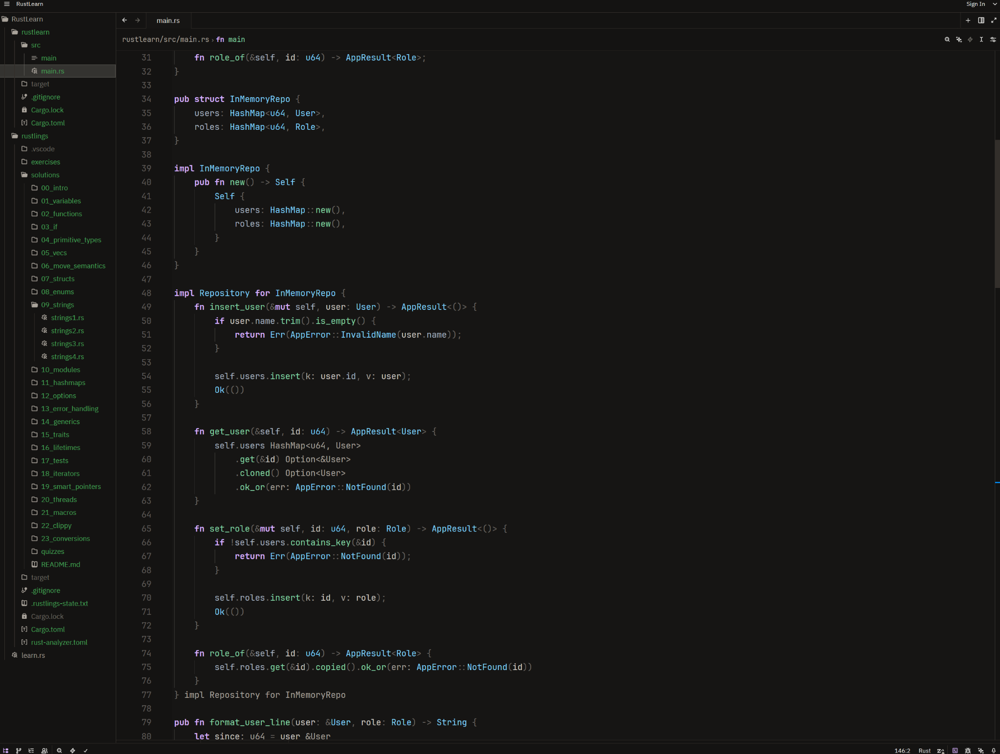

# LumenFold — Zed Theme Pack

A curated set of **dark** Zed themes designed for long coding sessions (OLED-friendly / low-glare).

## Previews

| Theme | File | Preview |
|---|---|---|
| NightKerning | `themes/lumenfold-nightkerning.json` |  |
| Convergence | `themes/lumenfold-convergence.json` |  |
| EmberKerning | `themes/lumenfold-emberkerning.json` |  |
| OpticNeutral | `themes/lumenfold-opticneutral.json` |  |

### Experimental

| Theme | File | Preview |
|---|---|---|
| GhostTrial | `themes/experimental/lumenfold-ghosttrial.json` |  |
| Flawless1 | `themes/experimental/flawless1.json` |  |

## Install (Local Themes)

Put any theme JSON file into your Zed themes directory:

- **macOS / Linux:** `~/.config/zed/themes/`
- **Windows:** `%USERPROFILE%\AppData\Roaming\Zed\themes\`

Then restart Zed and pick the theme in the Theme Selector.

### Quick install (Linux/macOS)
```bash
bash scripts/install.sh
```

### Quick install (Windows PowerShell)
```powershell
powershell -ExecutionPolicy Bypass -File scripts/install.ps1
```

## Notes

- Theme payloads (colors) are intentionally kept stable. Changes in this repo should be limited to packaging, naming, documentation, and screenshots unless explicitly requested.
- `lumenfold-opticneutral.json` is provided as a **single-theme** file (no bundled extras).

## Repository layout

- `themes/` — primary theme files
- `themes/experimental/` — drafts / A-B variants
- `screenshots/` — reference screenshots
- `scripts/` — install helpers

## License

MIT — see `LICENSE`.
